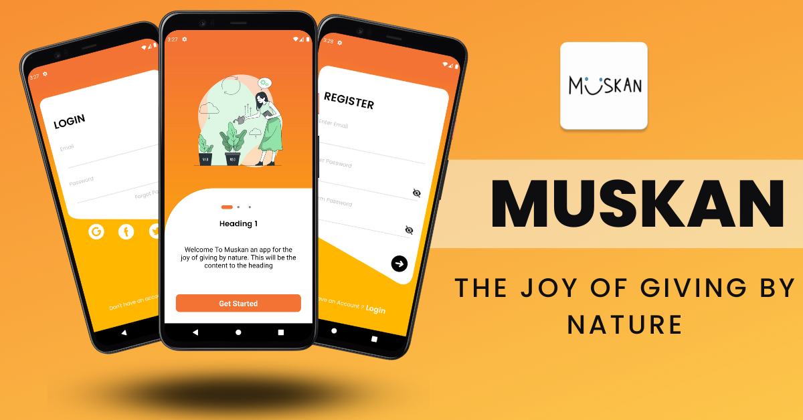
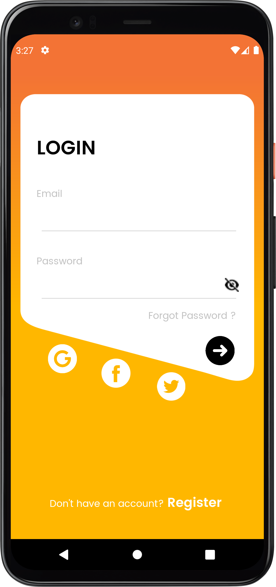
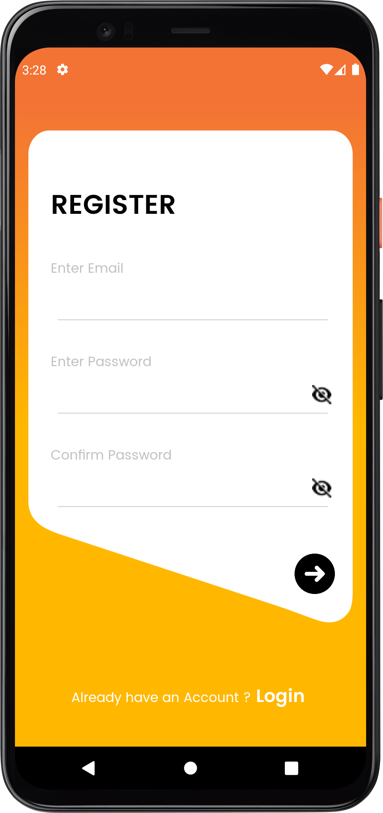

# Submit your PR on this new repo [Hacktoberfest](https://github.com/fineanmol/hacktoberfest) , There we are merging the PR that solves the Issues. 

In this current repo, there are alot of conflicts, we are not merging until all conflicts get resolved.


**This is a beginner-friendly project to help you get started with your
[hacktoberfest](https://hacktoberfest.digitalocean.com/). If you don't know where to start, feel free to watch the videos linked below, and read the contribution rules. Happy Learning <3 💙 !!**

P.S. Star ⭐ and Share this repository, if you had fun!! 😍

Hacktoberfest 2022

# 📌 Videos 📽️:

- [Hacktoberfest Intro](https://www.youtube.com/watch?v=mq_FIHdxmIk)
- [How to pull request [Overview]](https://youtu.be/DIj2q02gvKs)
- [Merge Conflict / comment](https://youtu.be/zOx5PJTY8CI)

# Muskan - The joy of giving by nature




[Work in progress 🚧]
==================

**Muskan App** is a fully functional Android app built with Kotlin, Java and XML. 
(Muskan- The joy of giving by nature) i.e, App that helps marriage/party halls and individuals 
to connect to the nearest places where this food could feed those in need and food wastage is minimised.


## Screenshots
<div style="display:flex;">



</div>


## Prerequisites

### System requirements

1. Any system with basic configuration.
2. Operating System: Windows / Linux / Mac

### Software requirements

1. Android Studio (If not, download it [here](https://developer.android.com/studio/)).

### Skill requirement

* Basic Knowledge of Git & GitHub.
* Familiar with Kotlin
* Java
* XML

## Contributing

## Setting up a local environment

### Forking repository

1. Firstly to make your copy of the project you have to fork the repository. To fork the repository, press the fork button. In case of any difficulties, refer to the image below
    

### Clone repository

1. Now after you have forked the project, it's time to clone it into your local device so that you can work properly.
2. In your forked repository click on the green code button and copy the provided link. In case of any difficulties, refer to the image below
    

3. Now on your desktop open Git Bash and type `git clone https://github.com/yournamehere/Muskan--The-joy-of-giving-by-nature.git`, and press enter
4. Now, your forked repository has been cloned in your device! 🎉


#### Create a Branch for your feature

Make sure your fork is up-to-date and create a topic branch for your feature or bug fix.  (The name `my-feature-branch` is an example. Choose whatever you like.)

```
git checkout main
git remote add upstream https://github.com/Bhawna1203/Muskan--The-joy-of-giving-by-nature.git
git pull upstream main
git checkout -b my-feature-branch
```

#### Build and Test

Ensure that you can build the project and run it on your mobile device before you create a pull request.


#### Write Code

Implement your feature or bug fix.

Make sure that your app builds and is successfully installed on your mobile device without errors.


#### Commit Changes

Make sure git knows your name and email address:

```
git config --global user.name "Your Name"
git config --global user.email "contributor@example.com"
```

Add the changed files to the index using [git add](https://git-scm.com/docs/git-add).  Most IDEs make this easy for you to do, so you won't need this command line version.
Writing [good commit logs](https://chris.beams.io/posts/git-commit/) is important. A commit log should describe what changed and why.

```
git add ...
git commit -m "Fixed Foo bug by changing bar"
```

#### Push to your GitHub repository

```
git push origin my-feature-branch
```


#### Make a Pull Request

Go to https://github.com/yournamehere/Muskan--The-joy-of-giving-by-nature and select your feature branch. Click the 'Pull Request' button and fill out the form. Pull requests are usually reviewed within a few days.

If code review requests changes (and it usually will) just `git push` the changes to your repository on the same branch, and the pull request will be automatically updated.


#### Rebase

If you've been working on a change for a while and other commits have been made to the project, rebase with upstream/master.

```
git fetch upstream
git rebase upstream/master
git push origin my-feature-branch -f
```

#### Check on Your Pull Request

Go back to your pull request after a few minutes/days and see whether it passed the code-review 
Everything should be fine if your PR is green ✅ and successfully merged or code changes will be requested by the maintainers.

#### Be Patient

It's likely that your change will not be merged and that the nitpicky maintainers will ask you to do more, or fix seemingly benign problems like [choices of variable names](https://quotesondesign.com/phil-karlton/). Hang in there!


## Thanks to all the contributors ❤️
Every contributor's efforts and time are deeply appreciated! Thank you. :smile:

<a href="https://github.com/Bhawna1203/Muskan--The-joy-of-giving-by-nature/graphs/contributors">
  
</a>
